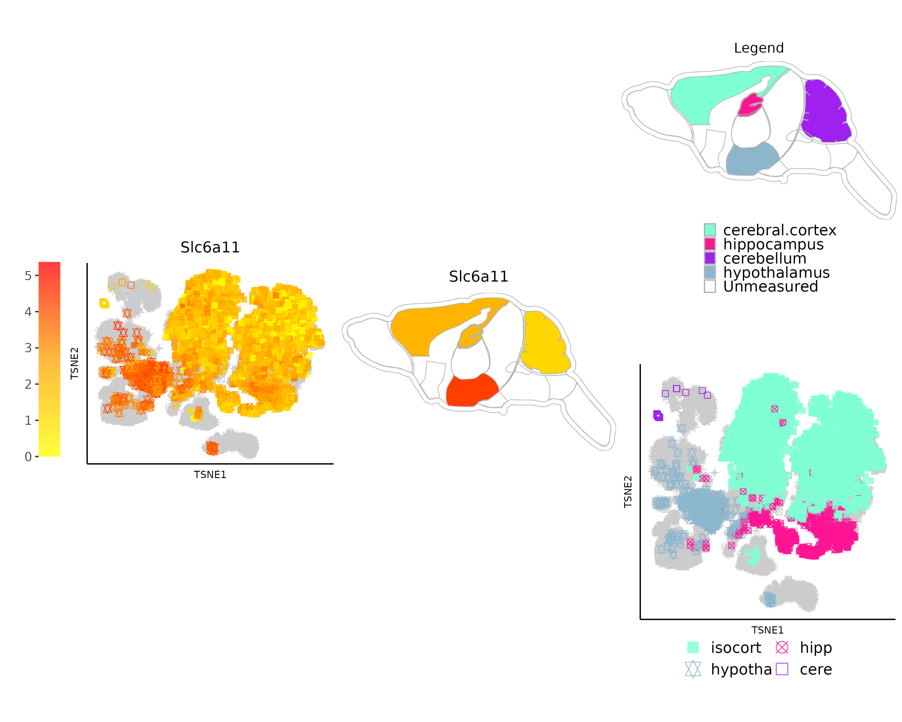
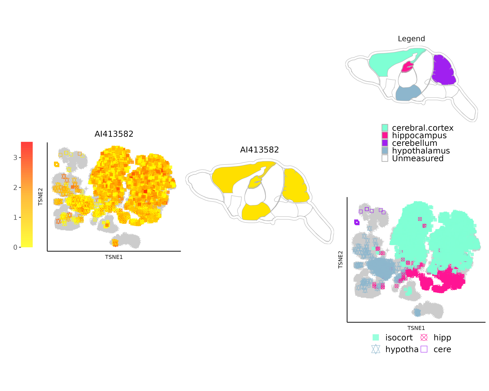
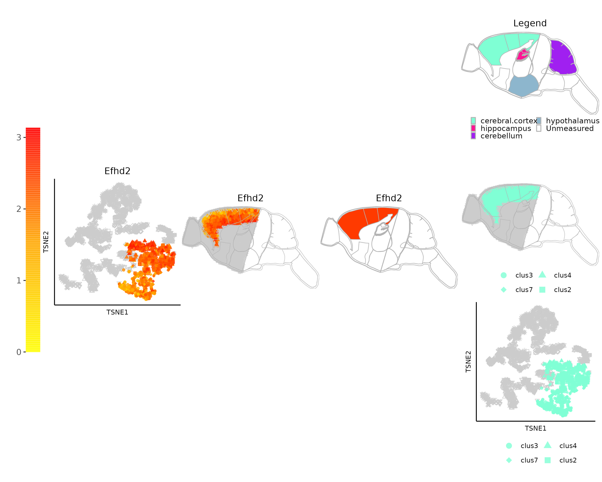

```{css, echo=FALSE}
pre code {
white-space: pre !important;
overflow-x: scroll !important;
word-break: keep-all !important;
word-wrap: initial !important;
}
```

```{r global_options, echo=FALSE, include=TRUE}
## ThG: chunk added to enable global knitr options. The below turns on
## caching for faster vignette re-build during text editing.
knitr::opts_chunk$set(cache=TRUE)
```

<!-- 
<style type="text/css">
 .main-container { max-width: 1800px; margin-left: 5px; margin-right: auto; }
</style>
<style>body { text-align: justify }</style>  

```{r css, echo = FALSE, results = 'asis'}
BiocStyle::markdown(css.files=c('file/custom.css'))
```
-->


```{r setup0, eval=TRUE, echo=FALSE, message=FALSE, warning=FALSE}
library(knitr); opts_chunk$set(message=FALSE, warning=FALSE)
```

This vignette serves to replicate the examples presented in the *spatialHeatmap* manuscript. As the pertinent functionalities have been introduced in the *spatialHeatmap* package's [vignettes](https://bioconductor.org/packages/devel/bioc/html/spatialHeatmap.html){target='_blank'}, this document offers concise explanations of each relevant functionality. Some code chunks are not evaluated when buiding this vignette due to long computation time.   

To build this vignette, download the [folder](https://github.com/jianhaizhang/spatialHeatmap_manuscript_data){target='_blank'} containing the source code, then run `rmarkdown::render('manuscript_examples.Rmd')` in the downloaded folder.   

# Getting started

The required packages and helper functions are loaded. To reduce runtime, intermediate results can be cached under `~/.cache/shm`.  

```{r eval=TRUE, echo=TRUE, results='hide'}
# R: 4.2.0; Bioconductor: 3.15
library(spatialHeatmap); library(SummarizedExperiment); library(ExpressionAtlas); library(ggplot2)
library(biomaRt) # v2.54.0 
library(enrichplot); library(clusterProfiler) # v4.6.0
source('function/fun.R') # Helper functions.  
cache.pa <- '~/.cache/shm'
```

# Spatial Enrichment {#spen}

The [Spatial Enrichment](https://bioconductor.org/packages/devel/bioc/vignettes/spatialHeatmap/inst/doc/spatialHeatmap.html#41_Spatial_Enrichment){target='_blank'} (SpEn) functionality is designed to identify groups of biomolecules (e.g. RNAs, proteins, metabolites) that are particularly abundant or enriched in certain spatial regions, such as tissue-specific transcripts. The chosen mouse RNA-Seq data compares tissue level gene expression across mammalian species [@Merkin2012-ak]. The following searches the Expression Atlas for expression data from 'kidney' and 'Mus musculus'.  

```{r eval=TRUE, echo=TRUE, results='hide'}
all.mus <- read_cache(cache.pa, 'all.mus') # Retrieve data from cache.
if (is.null(all.mus)) { # Save downloaded data to cache if it is not cached.
  all.mus <- searchAtlasExperiments(properties="kidney", species="Mus musculus")
  save_cache(dir=cache.pa, overwrite=TRUE, all.mus)
}
```

Among the many matching entries, accession 'E-MTAB-2801' is downloaded.  

```{r eval=TRUE, echo=TRUE, collapse=TRUE}
all.mus[7, ]
rse.mus <- read_cache(cache.pa, 'rse.mus') # Read data from cache.
if (is.null(rse.mus)) { # Save downloaded data to cache if it is not cached.
  rse.mus <- getAtlasData('E-MTAB-2801')[[1]][[1]]
  save_cache(dir=cache.pa, overwrite=TRUE, rse.mus)
}
colData(rse.mus)[1:3, ]
```

A targets file is loaded to the `colData` slot of `rse.mus`.  

```{r eval=TRUE, echo=TRUE, collapse=TRUE}
target.mus <- read.table('data/target_mouse.txt', header=TRUE, row.names=1, sep='\t') # Importing
colData(rse.mus) <- DataFrame(target.mus) # Loading
target.mus[1:3, ]
```

Five spatial features ('brain', 'liver', 'lung', 'colon', and 'kidney') and three experiment variables (mouse strains 'DBA.2J', 'C57BL.6', and 'CD1') are subsetted. The `com.by` argument specifies whether the enrichment will be performed on spatial features (`ft`) or experiment variables (`var`). In the following, `com.by` is set `ft`, so SpEn is performed for spatial features and the variables under each spatial feature are treated as replicates.   

```{r eval=TRUE, echo=TRUE}
data.sub.mus <- sf_var(data=rse.mus, feature='organism_part', ft.sel=c('brain', 'lung', 'colon', 'kidney', 'liver'), variable='strain', var.sel=c('DBA.2J', 'C57BL.6', 'CD1'), com.by='ft')
```

The subsetted data is [filtered](https://bioconductor.org/packages/devel/bioc/vignettes/spatialHeatmap/inst/doc/spatialHeatmap.html#324_Preprocess_Assay_Data){target='_blank'} to remove unreliable expression values.   

```{r eval=TRUE, echo=TRUE}
data.sub.mus.fil <- filter_data(data=data.sub.mus, pOA=c(0.5, 15), CV=c(0.8, 100), verbose=FALSE)
```

The Ensembl gene ids are converted to UniProt symbols.  

```{r eval=TRUE, echo=TRUE}
data.sub.mus.fil <- cvt_mart(input=data.sub.mus.fil, biomart='ensembl', dataset="mmusculus_gene_ensembl", mirror='www', filters='ensembl_gene_id', attributes=c("ensembl_gene_id", "uniprot_gn_symbol", "entrezgene_id", "go_id", "description"), target='uniprot_gn_symbol', use.cache=TRUE, cache.na='ann.mus', cache.dir='~/.cache/shm')
ann.mus <- rowData(data.sub.mus.fil)
```

SpEn is performed for each spatial feature with 'edgeR'. The count data are internally normalized by the 'TMM' method from 'edgeR'. The enrichment results are selected by log2 fold change (`log2.fc`) and FDR (`fdr`). The `outliers` argument specifies a number of outliers allowed in references.  

```{r eval=TRUE, echo=TRUE, results='hide'}
enr.res <- spatial_enrich(data.sub.mus.fil, method=c('edgeR'), norm='TMM', log2.fc=1, fdr=0.05, outliers=1)
```

The overlap of enriched biomolecules (`type='up'`) across spatial features are presented in an UpSet plot (`plot='upset'`).  

```{r enOvl, eval=TRUE, echo=TRUE, warnings=FALSE, fig.wide=TRUE, fig.cap=('Overlap of enriched biomolecules across spatial features.'), out.width="100%", fig.show='show', results='hide'}
ovl_enrich(enr.res, type='up', plot='upset', font.size=5, venn.arg=list(), order.by='freq')
```

The enriched and depleted genes in liver are queried from the enrichment results. In the 'type' column, 'up' and 'down' refer to 'enriched' and 'depleted' respectively, while the 'total' column shows the total reference features excluding outliers.  

```{r eval=TRUE, echo=TRUE, collapse=TRUE}
en.liver <- query_enrich(enr.res, 'liver')
up.liver <- subset(rowData(en.liver), type=='up' & total==4)
up.liver[1:3, 1:3]
dn.liver <- subset(rowData(en.liver), type=='down' & total==4)
dn.liver[1:3, 1:3]
```

The aSVG of mouse organs is imported.   

```{r eval=TRUE, echo=TRUE, collapse=TRUE, results='hide'}
svg.mus <- read_svg('img/mus_musculus.male.svg')
```

One enriched (Itih1) and one depleted (Mgat3) gene in mouse liver are chosen to plot enrichment spatial heatmaps (SHMs).   

```{r enr, eval=TRUE, echo=TRUE, warnings=FALSE, fig.wide=TRUE, fig.cap=('Enrichment SHMs. Top row: SHMs of spatially-enriched gene. Bottom row: SHMs of spatially-depleted gene.'), out.width="100%", fig.show='show', results='hide'}
# Aggregate replicates across spatial features by mean.
en.liver <- aggr_rep(en.liver, sam.factor='com.by', con.factor=NULL, aggr='mean')
dat.enrich <- SPHM(svg=svg.mus, bulk=en.liver)
shm(data=dat.enrich, ID=c('Itih1', 'Mgat3'), legend.r=1, legend.nrow=3, sub.title.size=12, ncol=2, bar.width=0.09, lay.shm='con')
```   

# Data Mining 

SHMs are suitable for comparing assay profiles among small number of biomolecules (e.g. genes) across spatial features. To also support analysis routines of larger number of biomolecules, *spatialHeatmap* integrates functionalities for identifying groups of biomolecules with similar and/or dissimilar assay profiles, and subsequently analyzing the results with data mining methods that scale to larger numbers of biomolecules than SHMs, such as [hierarchical clustering](https://bioconductor.org/packages/devel/bioc/vignettes/spatialHeatmap/inst/doc/spatialHeatmap.html#43_Hierarchical_Clustering){target='_blank'} and [network analysis](https://bioconductor.org/packages/devel/bioc/vignettes/spatialHeatmap/inst/doc/spatialHeatmap.html#43_Network_Graphs){target='_blank'} methods.    

## Hierarcical clustering

The replicates of organs in the assay data are aggregated by mean. The query gene used in this example is 'Ugp2' that is spatially enriched in mouse liver. After subsetting the aggregated assay matrix to the 15\% most similar members from a correlation-based search (including the query), hierarchical clustering is performed. The clustering results are presented in the form of a matrix heatmap (Figure \@ref(fig:mhm)). In Figure \@ref(fig:mhm), the rows and columns are sorted by the dendrograms obtained from the hierarchical clustering step, and the query gene is indicated by a black line.   

```{r eval=TRUE, echo=TRUE, collapse=TRUE}
# Aggregate replicates.
mus.nor.aggr <- aggr_rep(enr.res$data, sam.factor='organism_part', con.factor=NULL, aggr='mean')
# Subset assay data.
sub.mat <- submatrix(data=mus.nor.aggr, ID='Ugp2', p=0.15)
dim(sub.mat)
```

```{r mhm, eval=TRUE, echo=TRUE, warnings=FALSE, fig.cap=("Matrix Heatmap. Rows are genes and columns are samples. The query gene is    tagged by black lines."), out.width='100%'}
mhm.res <- matrix_hm(ID='Ugp2', data=sub.mat, scale='row', angleCol=80, angleRow=35, cexRow=1, cexCol=1.2, margin=c(10, 6), static=TRUE, arg.lis1=list(offsetRow=0.01, offsetCol=0.01))
```

The row dendrograms are cut at the height `h=3.685629` to obtain the cluster containing the query gene.  

```{r eval=TRUE, echo=TRUE, collapse=TRUE}
# Cut row dendrograms to obtain the cluster.  
cl <- cut_dendro(dendro=mhm.res$rowDendrogram, h=3.685629, target='Ugp2'); cl
# Entrez gene ids of the cluster. 
df.entr <- subset(ann.mus, uniprot_gn_symbol %in% cl)
entriz <- unique(df.entr$entrezgene_id); entriz
# Export the cluster containing the query gene. 
# rownames(df.entr) <- seq_len(nrow(df.entr))
# write.table(df.entr[, c('ensembl_gene_id', 'uniprot_gn_symbol', 'entrezgene_id')], 'cluster_hc.xlsx', col.names=T, row.names=T, sep='\t')
```

KEGG enrichment is performed on the cluster containing the query. The Peroxisome pathway (mmu04146) is the most highly enriched category (Figure \@ref(fig:keghcl)). Peroxisomes are involved in many important metabolic processes including lipid metabolism in hepatocytes [@Knebel2015-qh]. This is in alignment with the fact that the query gene 'Ugp2' is spatially enriched in liver.  

```{r keghcl, eval=TRUE, echo=TRUE, warnings=FALSE, fig.cap=("KEGG enrichment result in the hierarchical clustering example."), out.width='100%'}
kk <- enrichKEGG(gene = entriz, keyType='kegg', organism = 'mmu', pvalueCutoff = 0.05, pAdjustMethod='BH', qvalueCutoff=0.05)
df.kk <- as.data.frame(kk)
barplot(kk, showCategory=5)
# browseKEGG(kk, 'mmu04146')
```


## Network Analysis

The objective of [network analysis](https://bioconductor.org/packages/devel/bioc/vignettes/spatialHeatmap/inst/doc/spatialHeatmap.html#43_Network_Graphs){target='_blank'} is to identify network clusters that can be visualized in the form of network graphs. The network clusters represent groups of genes sharing highly similar expression profiles. Briefly, to run this analysis, a global network is constructed for the genes stored in the assay matrix that is subsequently partitioned into network clusters.   

The same input assay matrix used in the hierarchical clustering example are used in the network analysis. The spatially-enriched gene 'Serpina1b' in the liver is chosen as the query for this analysis. After subsetting the assay matrix to the 15\% most similar members from a correlation-based search (including the query), network analysis is performed. This analysis produces results in the form of an adjacency matrix and cluster assignments. The adjacency matrix contains adjacency values (expression similarities) for each pair of genes, while the cluster assignments are provided at four different levels of stringency (0, 1, 2, and 3). Higher stringency levels result in more clusters with smaller sizes. Within each version of the cluster assignment, a value of '0' indicates that a gene is not assigned to any cluster.  

```{r eval=TRUE, echo=TRUE, collapse=TRUE}
# Subset the assay data.  
sub.mat <- submatrix(data=mus.nor.aggr, ID='Serpina1b', p=0.15)
dim(sub.mat)
# Identify network clusters.
adj.mod <- adj_mod(data=sub.mat)
# Adjacency matrix. 
adj.mod[['adj']][1:3, 1:3]
# Four versions of network clusters. 
adj.mod[['mod']][1:3, ] 
```

The cluster containing the query gene is presented in a network graph (Figure \@ref(fig:net)). Nodes and edges in the graph represent genes and adjacency values between genes, respectively. The node size is proportional to the connectivity which is the sum of a gene's adjacency values with all other genes in the same cluster.   

```{r net, eval=TRUE, echo=TRUE, warnings=FALSE, fig.cap=("Network graph. Node size denotes gene connectivity while edge thickness stands for expression similarity.") } 
net <- network(ID='Serpina1b', data=sub.mat, adj.mod=adj.mod, ds=3, adj.min=0, vertex.label.cex=1, vertex.cex=5, static=TRUE)
```

Entrez gene ids are obtained for the cluster.   

```{r eval=TRUE, echo=TRUE, collapse=TRUE}
# Cluster containing the query. 
cl <- rownames(net); cl
df.entr.net <- subset(ann.mus, uniprot_gn_symbol %in% cl)
# Export the cluster. 
# rownames(df.entr.net) <- seq_len(nrow(df.entr.net))
# write.table(df.entr.net[, c('ensembl_gene_id', 'uniprot_gn_symbol', 'entrezgene_id')], 'module.xlsx', col.names=T, row.names=T, sep='\t')
# Entrez gene ids of the cluster. 
entriz <- unique(df.entr.net$entrezgene_id); entriz
```

KEGG enrichment is performed on the cluster containing the query gene (Figure \@ref(fig:kegnet)). The Complement and Coagulation Cascades pathway (mmu04610) is most significantly enriched in this cluster. This finding aligns with the fact that the query gene 'Serpina1b' is enriched in liver, as the liver is known to express a significant portion of complement proteins [@Thorgersen2019-yd].    

```{r kegnet, eval=TRUE, echo=TRUE, warnings=FALSE, fig.cap=("KEGG enrichment result in the network analysis example."), out.width='100%'}
kk <- enrichKEGG(gene = entriz, keyType='kegg', organism = 'mmu', pvalueCutoff = 0.05, pAdjustMethod='BH', qvalueCutoff=0.05)
df.kk <- as.data.frame(kk)
barplot(kk, showCategory=5)
# browseKEGG(kk, 'mmu04146')
```

# Use Case

*spatialHeatmap* offers functionalities for analyzing spatial assay data with SHMs, and optionally extending them with large-scale data mining routines. The following use case example demonstrates the advantages of these utilities within a discovery workflow, and the input bioassay data are the same as the [SpEn](#spen) example [@Merkin2012-ak]. A typical analysis starts with a biomolecule or feature of interest. In this example, the brain is used as the query spatial feature, and the same SpEn process is performed as the [SpEn](#spen) example. To prevent redundancy, the enrichment results (`enr.res`) from the SpEn example are used directly.    

The enrichment results are queried by brain. Among the enriched genes in brain, 'Grik3' is chosen as the query gene. This gene is interesting since it codes for a well-known excitatory neurotransmitter receptor that is involved in the formation of various neurodegenerative diseases and cancers [@Stepulak2009-jw; @Xiao2019-rg].  

```{r eval=TRUE, echo=TRUE, collapse=TRUE}
en.brain <- query_enrich(enr.res, 'brain')
up.brain <- subset(rowData(en.brain), type=='up' & total==4) 
up.brain['Grik3', 1:3]
```

```{r eval=FALSE, echo=FALSE, collapse=TRUE}
w <- which(rownames(enr.res$result$brain$up) %in% 'Grik3'); w

# Select 5 eniched genes for demonstration.
dat <- en.brain[c(1:4, 1509), grepl('C57BL.6', colnames(en.brain))]
# Line graph.
graph_line(assay(dat), line.width=2, lgd.pos='bottom') + theme(panel.grid.minor.y = element_line(color = '#B3B3B3', size = 0.75, linetype = 1))

# Spatial heatmap
asy <- as.data.frame(assay(dat))
asy$gene <- rownames(asy)
asy.melt <-  melt(asy, id = c('gene'))
ggplot(asy.melt, aes(gene, variable, fill= value)) + geom_tile() + scale_fill_gradient(low = "yellow", high = "red") + theme(text = element_text(size=20))
```

After subsetting the assay matrix to the 15\% most similar members from a correlation-based search (including 'Grik3'), hierarchical clustering is performed. The clustering results are presented in the form of a matrix heatmap (Figure \@ref(fig:mhm)). In Figure \@ref(fig:mhm), the rows and columns are sorted by the dendrograms obtained from the hierarchical clustering step, and the query gene is indicated by a black line.   

```{r eval=TRUE, echo=TRUE, collapse=TRUE}
sub.mat <- submatrix(data=mus.nor.aggr, ID='Grik3', p=0.15)
dim(sub.mat)
```

```{r mhmuse, eval=TRUE, echo=TRUE, warnings=FALSE, fig.cap=("Matrix Heatmap in the use case. Rows are genes and columns are samples. The query gene is tagged by black lines."), out.width='100%'}
mhm.res <- matrix_hm(ID='Grik3', data=sub.mat, scale='row', angleCol=80, angleRow=35, cexRow=0.8, cexCol=1.2, margin=c(10, 6), static=TRUE, arg.lis1=list(offsetRow=0.01, offsetCol=0.01))
```

The row dendrograms are cut at the height `h=7.149385` to obtain the cluster containing the query gene ('Grik3' cluster).    

```{r eval=TRUE, echo=TRUE, collapse=TRUE}
# Cut row dendrograms to obtain the cluster.  
cl <- cut_dendro(dendro=mhm.res$rowDendrogram, h=7.149385, target='Grik3'); cl
# Entrez gene ids of the cluster. 
df.entr <- subset(ann.mus, uniprot_gn_symbol %in% cl)
entriz <- unique(df.entr$entrezgene_id); entriz
# Export the cluster containing the query gene. 
# rownames(df.entr) <- seq_len(nrow(df.entr))
# write.table(df.entr[, c('ensembl_gene_id', 'uniprot_gn_symbol', 'entrezgene_id')], 'cluster_hc.xlsx', col.names=T, row.names=T, sep='\t')
```

To functionally annotate the obtained gene cluster, KEGG and GO enrichments are performed. The result shows that the 'Grik3' cluster is enriched in genes involved in cell adhesion (Figure \@ref(fig:keguse)) and synapse-related (Figure \@ref(fig:gouse)) activities, respectively. This agrees well with the fact that 'Grik3' is a well-characterized neurotransmitter receptor in the plasma membrane.   

```{r keguse, eval=TRUE, echo=TRUE, warnings=FALSE, fig.cap=("KEGG enrichment result in the use case."), out.width='100%'}
kk <- enrichKEGG(gene = entriz, keyType='kegg', organism = 'mmu', pvalueCutoff = 0.05, pAdjustMethod='BH', qvalueCutoff=0.05)
df.kk <- as.data.frame(kk)
barplot(kk, showCategory=5)
```


```{r gouse, eval=TRUE, echo=TRUE, warnings=FALSE, fig.cap=("GO enrichment result in the use case."), out.width='100%'}
go <- enrichGO(gene = entriz, keyType = "ENTREZID", OrgDb = 'org.Mm.eg.db', ont = 'ALL', pAdjustMethod = 'BH', pvalueCutoff  = 0.05, qvalueCutoff  = 0.05, readable = TRUE)
df.go <- as.data.frame(go)
barplot(go, showCategory=5)
```

SHM plotting is used to inspect the spatial expression patterns of the genes in the 'Grik3' cluster (Figure \@ref(fig:shmuse)). The results indicate that the genes of the 'Grik3' cluster are higher expressed in brain than other tissues. In addition, six of these genes are also relatively high expressed in liver tissue. In contrast to this, all other genes of the same cluster are exclusively enriched in brain. For clearity, two representative genes 'Stx1b' and 'Grik3' are shown in Figure \@ref(fig:shmuse).  

```{r shmuse, eval=TRUE, echo=TRUE, warnings=FALSE, fig.wide=TRUE, fig.cap=('Spatial heatmaps in the use case.'), out.width="100%", fig.show='show', results='hide'}
# Aggregate replicates across spatial features by mean.
en.brain <- aggr_rep(en.brain, sam.factor='com.by', con.factor=NULL, aggr='mean')
dat.enrich <- SPHM(svg=svg.mus, bulk=en.brain)
shm(data=dat.enrich, ID=c('Stx1b', 'Grik3'), legend.r=1, legend.nrow=3, sub.title.size=12, ncol=2, bar.width=0.09, lay.shm='con')
```   

# Co-visualization

The [co-visualization](https://bioconductor.org/packages/devel/bioc/vignettes/spatialHeatmap/inst/doc/covisualize.html#1_Introduction){target='_blank'} feature integrates tissue with single-cell data by co-visualizing them in composite plots that combine SHMs with embedding plots of high-dimensional data. The resulting spatial context information is important for gaining insights into the tissue-level organization of single cell data or vice versa. The following examples showcase several important functionalities of the co-visualization tool. The data used in these examples includes single-cell [@Ortiz2020-yt] and bulk [@Vacher2021-xg] RNA-seq data from multiple tissues of mouse brain. The tissues represented in both bulk and single cell data are cerebral cortex (isocortex), hippocampus, hypothalamus, and cerebellum.

The bulk and single-cell data of mouse brain are downloaded and imported. Due to long computation time on the real single-cell data, most of the following code in this section are not evaluated when building this vignette.  

```{r eval=FALSE, echo=TRUE, collapse=TRUE}
set.seed(50) # Obtain reproducible results. 
# Load help functions.
source('function/bulk_dat.R')
source('function/scell_dat.R')

# Import the bulk data.
blk.mus.brain <- blk_dat_mus('data/bulk_mouse_brain.xls')
blk.mus.brain[1:3, ]

# Download single-cell data (GSE147747_expr_raw_counts_table.tsv, GSE147747_meta_table.tsv) at https://www.ncbi.nlm.nih.gov/geo/query/acc.cgi?acc=GSE147747, then import the dowloaded files. 
sc.mus.brain <- sc_dat_mus_brain(sc.pa= 'GSE147747_expr_raw_counts_table.tsv', meta.pa='GSE147747_meta_table.tsv') 
sc.mus.brain[1:3, 1:5]
```

Import the aSVG of mouse brain.  

```{r eval=TRUE, echo=TRUE, collapse=TRUE, results='hide'}
svg.mus.brain <- read_svg("img/mus_musculus.brain.svg")
```

```{r eval=TRUE, echo=TRUE, collapse=TRUE, results='show'}
tail(svg.mus.brain[, 2][[1]], 3)[, c('feature', 'id')]
```

Convert bulk tissue identifiers to spatial features in the aSVG.  

```{r eval=FALSE, echo=TRUE, collapse=TRUE}
cvt_vecter <- spatialHeatmap:::cvt_vector
colnames(blk.mus.brain) <- unname(cvt_vecter(from=c('CERE', 'HIPP', 'CERE.CORTEX', 'HYPOTHA'), to=c('cerebellum', 'hippocampus', 'cerebral.cortex', 'hypothalamus'), target=colnames(blk.mus.brain)))
blk.mus.brain[1:2, ]
blk <- SummarizedExperiment(assays=list(counts=blk.mus.brain), colData=DataFrame(bulk=colnames(blk.mus.brain)))
```

Genes in bulk data are filtered according to expression counts $\ge$
5 at a proportion of $\ge$ 0.2 across bulk samples and coefficient of variance between 0.2 and 100.  

```{r eval=FALSE, echo=TRUE, collapse=TRUE}
blk.fil <- filter_data(data=blk, pOA=c(0.2, 5), CV=c(0.2, 100)); dim(blk.fil)
```

The single cell data are reduced to genes with expression values $\ge$ 1 (cutoff) across $\ge$ 7\% cells and to cells with expression values $\ge$ 1 (cutoff) across $\ge$ 5% genes. After that, bulk and single-data are reduced to common genes between them.   

```{r eval=FALSE, echo=TRUE, collapse=TRUE}
blk.sc <- filter_cell(sce=sc.mus.brain, bulk=blk.fil, cutoff=1, p.in.cell=0.7, p.in.gen=0.5); blk.sc
```

```{r eval=FALSE, echo=FALSE, collapse=TRUE}
bulk <- blk.sc$bulk
save(bulk, file='data/bulk') 
load('data/bulk') 
```

SpEn is performed across all tissues in the bulk data.  

```{r eval=FALSE, echo=TRUE, collapse=TRUE}
# Separate bulk data from single-cell data.
bulk <- blk.sc$bulk
# All tissues are selected for SpEn.
blk.sub <- sf_var(data=bulk, feature='bulk', ft.sel=colnames(bulk), variable=NULL, var.sel=NULL, com.by='ft')
# SpEn.
enr.res <- spatial_enrich(blk.sub, method=c('edgeR'), norm='TMM', log2.fc=1, fdr=0.05, outliers=0)
# Enrichment results across tissues.
ovl_enrich(enr.res, type='up', plot='upset', font.size=5, venn.arg=list(), order.by='freq')
```

As an example, the enriched and depleted genes of hypothalamus are queried from the enrichment results.  

```{r eval=FALSE, echo=TRUE, collapse=TRUE}
en.hypo <- query_enrich(enr.res, 'hypothalamus')
# Enriched.
up.hypo <- subset(rowData(en.hypo), type=='up' & total==3)
dim(up.hypo); up.hypo[1:2, 1:3]
# Depleted.
dn.hypo <- subset(rowData(en.hypo), type=='down' & total==3)
dim(dn.hypo); dn.hypo[1:2, 1:3]
```
Prior to co-visualizing bulk and single-cell data, these two data types are jointly normalized.  

```{r eval=FALSE, echo=TRUE, collapse=TRUE}
blk.sc.nor <- read_cache(cache.pa, 'blk.sc.nor')
if (is.null(blk.sc.nor)) {
  blk.sc.nor <- norm_cell(sce=blk.sc$cell, bulk=blk.sc$bulk, com=FALSE)
  save_cache(dir=cache.pa, overwrite=TRUE, blk.sc.nor)
}
```

```{r eval=FALSE, echo=FALSE, collapse=TRUE}
save(blk.sc.nor, file='data/blk.sc.nor')
load('data/blk.sc.nor')
```

Bulk and single-cell data are separated, then tissue replicates are aggregated by mean, and dimensionalities are reduced for single-cell data using PCA, UMAP, and TSNE.   

```{r eval=FALSE, echo=TRUE, collapse=TRUE}
# Aggregated tissue replicates.
blk.aggr <- aggr_rep(data=blk.sc.nor$bulk, assay.na='logcounts', sam.factor='sample', aggr='mean')
# Reduce dimensionalities for single-cell data. 
cell <- reduce_dim(blk.sc.nor$cell)
```

```{r eval=FALSE, echo=FALSE, collapse=TRUE}
save(cell, file='data/cell')
load('data/cell')
```

Bulk tissues 'cerebral.cortex', 'hypothalamus', 'hippocampus', and 'cerebellum' are matched with corresponding cells labeled 'isocort', 'hypotha', 'hipp', and 'cere', respectively.  

```{r eval=FALSE, echo=TRUE, collapse=TRUE}
match2cell <- list(cerebral.cortex=c('isocort'), hypothalamus=c('hypotha'), hippocampus='hipp', cerebellum='cere')
```

The spatially enriched (marker) gene 'Slc6a11' in hypothalamus is chosen for co-visualizing the bulk and single-cell data using the 'cell-by-value' coloring, where each cell and tissue is colored independently accoring expression values of 'Slc6a11'. In this example, cells with high expression levels (red in the left embedding plot) can be associated with hypothalamus based on the expression similarity of 'Slc6a11' in the SHM (Figure \@ref(fig:clas)). Additionally, cells from different tissues (known from available cell annotations) with similar expression of 'Slc6a11' may represent the same or similar cell types present in different source tissues (e.g. blood vessels).   

```{r eval=FALSE, echo=TRUE, collapse=TRUE}
dat.sep <- SPHM(svg=svg.mus.brain, bulk=blk.aggr, cell=cell, match=match2cell)
gg <- covis(data=dat.sep, ID='Slc6a11', sam.factor='sample', con.factor=NULL, dimred='TSNE', cell.group='sample', tar.bulk=names(match2cell), bar.width=0.07, dim.lgd.nrow=2, dim.lgd.text.size=12, height=0.7, legend.r=0.2, legend.key.size=0.02, legend.text.size=12, legend.nrow=5, col.idp=TRUE, vari.cell=NULL, h=0.35, dim.axis.font.size=8, sub.title.size=12) 
```

```{r eval=FALSE, echo=FALSE, collapse=TRUE}
ggsave(file="img/covis_clas.jpg", plot=spatialHeatmap::output(gg)$spatial_heatmap, width=10, height=8)
```

```{r clas, echo=FALSE, fig.wide=TRUE, out.width="100%", fig.cap=("Co-visualization: single cell classification via marker biomolecules.")}
 
```

The SpEn analysis of bulk data might fail to detect biomolecules that are only differentially expressed in sub-features of a chosen tissue. The co-visualization functionality can be used to overcome this limitation. Figure \@ref(fig:sub) shows a co-visualization for gene 'AI413582' that is not detected as spatially enriched in any of the assayed tissues. The embedding plot with 'cell-by-value' coloring reveals that this gene is only selectively expressed in a sub-population of cerebral cortex (isocortex) cells.  

Identify non-spatially enriched genes.  

```{r eval=FALSE, echo=TRUE, collapse=TRUE}
en.cort <- query_enrich(enr.res, 'cerebral.cortex')
up.cort <- subset(rowData(en.cort), type=='up' & total==3)
dim(up.cort); up.cort[1:2, 1:3]
# Non-spatially enriched genes.
ids <- setdiff(rownames(blk.aggr), rownames(en.cort)); ids[1:3]
```

```{r eval=FALSE, echo=TRUE, collapse=TRUE}
gg <- covis(data=dat.sep, ID='AI413583', sam.factor='sample', con.factor=NULL, dimred='TSNE', cell.group='sample', tar.bulk=names(match2cell), bar.width=0.07, dim.lgd.nrow=2, dim.lgd.text.size=12, height=0.7, legend.r=0.15, legend.key.size=0.02, legend.text.size=12, legend.nrow=5, col.idp=TRUE, vari.cell=NULL, h=0.35, dim.axis.font.size=8, sub.title.size=12) 
```

```{r eval=FALSE, echo=FALSE, collapse=TRUE}
ggsave(file="img/covis_sub.jpg", plot=spatialHeatmap::output(gg)$spatial_heatmap, width=10, height=8)
```

```{r sub, echo=FALSE, fig.wide=TRUE, out.width="100%", fig.cap=("Co-visualization: identifiying sub-feature selective genes.")}
 
```

## Spatially Resolved Single-Cell Data

Spatially resolved single-cell (SRSC) assay data (e.g. RNA-seq) preserve the location of cells within the corresponding source features (e.g. tissues). To plot this data, *spatialHeatmap* projects (overlays) the spatially resolved single-cell data onto the corresponding features in anatomical images. The resulting plots are referred to as single-cell SHMs (scSHM, Figure \@ref(fig:srsc)). The following example demonstrates the co-visualization of SRSC (10X Visium) and bulk [@Vacher2021-xg] RNA-seq data of the sagittal mouse brain, where the latter is from the same study at Figure \@ref(fig:clas).    

The SRSC data are loaded through the *Seurat* and *SeuratData* packages [@seurat1; @seurat2; @seurat3; @seurat4].  

```{r eval=FALSE, echo=TRUE, collapse=TRUE}
# Install the SeuratData package: devtools::install_github('satijalab/seurat-data') 
library(Seurat); library(SeuratData);
# Load the mouse brain data: InstallData("stxBrain")
set.seed(50)
brain <- LoadData("stxBrain", type = "anterior1")
```

The bulk and SRSC data are jointly normalized.  

```{r eval=FALSE, echo=TRUE, collapse=TRUE}
nor.lis <- norm_srsc(cell=brain, assay='Spatial', bulk=bulk)
srt.sc <- nor.lis$cell; blk.sp <- nor.lis$bulk
```

After separated from single-cell data, the tissue replicates in the bulk data are averaged.  

```{r eval=FALSE, echo=TRUE, collapse=TRUE}
blk.aggr.sp <- aggr_rep(data=blk.sp, assay.na='logcounts', sam.factor='sample', aggr='mean')
```

After separated from bulk data, dimensionalities in SRSC data are reduced, then clustering is performed on the reduced dimensions.  

```{r eval=FALSE, echo=TRUE, collapse=TRUE}
# Reduce dimensionalities.
srt.sc <- RunPCA(srt.sc, assay = "SCT", verbose = FALSE)
srt.sc <- RunUMAP(srt.sc, assay = "SCT", dims = 1:5)
srt.sc <- RunTSNE(srt.sc, assay = "SCT", reduction = "pca", dims = 1:5)
# Cluster cells.
srt.sc <- FindNeighbors(srt.sc, reduction = "pca", dims = 1:30)
srt.sc <- FindClusters(srt.sc, verbose = FALSE)
srt.sc$seurat_clusters <- paste0('clus', srt.sc$seurat_clusters)
```

The mouse brain aSVG specific to SRSC data is imported. The coordinates of spatial spots in the SRSC data are rotated by 90 degrees to align with the anatomical strucutures in the aSVG.   

```{r eval=FALSE, echo=TRUE, collapse=TRUE}
svg.mus <- read_svg('img/mus_musculus.brain_sp1.svg', srsc=TRUE)
angle(svg.mus)[[1]] <- angle(svg.mus)[[1]] + 90
```

Each cell cluster is assigned a unqiue shape.  

```{r eval=FALSE, echo=TRUE, collapse=TRUE}
grp <- unique(srt.sc$seurat_clusters)
sp <- setNames(c(0, 2:14, 19:25, 32:127)[seq_along(grp)], grp)
sp[c('clus2', 'clus3', 'clus4', 'clus7')] <- 15:18 
```

Figure \@ref(fig:srsc) is the co-visualization of SRSC and bulk data with the 'cell-by-value' coloring. The gene 'Efhd2' is spatially enriched in cerebral cortex, which is detected by SpEn (SHM on the right in Figure \@ref(fig:srsc)). The cluster labels are utilized as the cell group labels (`cell.group='seurat_clusters'`). The 'cerebral.cortex' tissue aligns anatomically with cell clusters denoted as 'clus3', 'clus4', 'clus7', and 'clus2'. This alignment is defined by a `list` called `lis.match`. These four clusters are shown in the middle scSHM in Figure \@ref(fig:srsc), where each cell is positioned according to its spatial coordinates. These cells are also presented in the embedding plot (on the left in Figure \@ref(fig:srsc)). The grey dots in Figure \@ref(fig:srsc) denote cells belonging to other clusters. The scSHM reveals that 'Efhd2' has high and low expression levels in sub-features of cerebral cortex, respectively. These sub-features roughly form two clusters in the embedding plot. This result may indicate that there are potentially novel cell types present in the cerebral cortex.   

```{r eval=FALSE, echo=TRUE, collapse=TRUE}
# Association between "cerebral.cortex" and clusters.
lis.match <- list(cerebral.cortex=c('clus3', 'clus4', 'clus7', 'clus2')) 
dat.srsc <- SPHM(svg=svg.mus, bulk=blk.aggr.sp, cell=srt.sc, match=lis.match)
covis(data=dat.srsc, ID='Efhd2', assay.na='logcounts', dimred='TSNE', cell.group='seurat_clusters', tar.bulk=c('cerebral.cortex'), col.idp=TRUE, bar.width=0.07, dim.lgd.nrow=2, dim.lgd.text.size=8, legend.r=0.1, legend.key.size=0.013, legend.text.size=9, legend.nrow=3, h=0.6, profile=TRUE, ncol=3, vjust=5, dim.lgd.key.size=3, size.r=0.97, dim.axis.font.size=8, size.pt=1.5, shape=sp, lgd.plots.size=c(0.35, 0.25, 0.35), verbose=FALSE)
```

```{r eval=FALSE, echo=FALSE, collapse=TRUE}
ggsave(file="img/covis_srsc.jpg", plot=spatialHeatmap::output(gg)$spatial_heatmap, width=10, height=8)
```

```{r srsc, echo=FALSE, fig.wide=TRUE, out.width="100%", fig.cap=("Co-visualization: spatially resolved single-cell data.")}
 
```

## Visualizing Bulk Deconvolution Results

Many deconvolution algorithms have been developed to infer cellular compositions in bulk data [@Newman2015-sv; @Newman201-mm; @Racle2017-ya; @Gong2013-yu; @Wang2019-qo] that can be visualized using the co-visualization module. Specifically, the cell type proportions estimated by the deconvolution methods will be used to calculate an expression matrix from the bulk data where rows are genes and columns are inferred cell types. Next, the cell type expression matrix and the bulk assay data will be used for co-visualization (Figure \@ref(fig:decon). This utility is showcased using *MuSiC* [@Wang2019-qo] for deconvoluting bulk RNA-Seq data from human pancreatic islets [@Fadista2014-ec] with matching single cell data [@Segerstolpe2016-oe].   

The bulk and single-cell data of human pancreatic islets are downloaded and imported.  

```{r eval=TRUE, echo=TRUE, collapse=TRUE}
library(MuSiC); library(SingleCellExperiment)
set.seed(50)
# Bulk data: https://xuranw.github.io/MuSiC/data/GSE50244bulkeset.rds
blk.eset <- readRDS('data/GSE50244bulkeset.rds')
blk.de <- exprs(blk.eset); blk.de[1:2, 1:3]
# Single-cell data: https://xuranw.github.io/MuSiC/data/EMTABsce_healthy.rds
sc.de <- readRDS('data/EMTABsce_healthy.rds'); colData(sc.de)[1:2, ]
```

Bulk deconvolution is performed with *MuSiC* [@Wang2019-qo].  

```{r eval=TRUE, echo=TRUE, collapse=TRUE}
# Deconvolution.
res.p <- music_prop(bulk.mtx = blk.de, sc.sce = sc.de, clusters = 'cellType', samples = 'sampleID', select.ct = c('alpha', 'beta', 'delta', 'gamma', 'acinar', 'ductal'), verbose = FALSE)
names(res.p)
# Deconvolution results.
prop <- res.p$Est.prop.weighted; prop[1:3, ]
```

By using the inferred cell type proportions, the expression matrix of inferred cell types are calculated from the bulk data of one subject (Sub1). The chosen bulk data are filtered according to expression counts $\ge$ 5. The expression matrix of inferred cell types is stored in a *SingleCellExperiment* object.  

```{r eval=TRUE, echo=TRUE, collapse=TRUE}
# Filter the chosen bulk data. 
blk.sel <- subset(data.frame(blk.de), Sub1 >= 5)[, 'Sub1', drop=FALSE]
# Calculat expression matrix of inferred cell types.
res.de <- lapply(X=seq_len(ncol(blk.sel)), bulk=blk.sel, FUN=function(i, bulk) {
  lis0 <- lapply(seq_len(nrow(bulk)), function(r) { 
    round(data.frame(bulk)[r, i, drop=TRUE] * prop[i, ])
  }); dat <- do.call('rbind', lis0)
  rownames(dat) <- rownames(bulk); dat
})
# Store the expression matrix of cell types in a SingleCellExperiment object.
res.sc <- res.de[[1]]; res.sc[1:2, ]
res.sc <- SingleCellExperiment(list(counts=res.sc)) 
```

Filter the cell-type expression matrix, jointly normalize the cell and bulk data, and separate the two data types.  

```{r eval=TRUE, echo=TRUE, collapse=TRUE, results='hide'}
# Filter cell-type expression data.
blk.sc.de <- filter_cell(sce=res.sc, bulk=blk.sel, cutoff=1, p.in.cell=0.1, p.in.gen=0.5)
# Jointly normalize cell and bulk data. 
blk.se.de.nor <- norm_data(data=cbind(blk.sc.de$bulk, blk.sc.de$cell), norm.fun='CNF', log2.trans=TRUE)
assayNames(blk.se.de.nor) <- 'logcounts'
# Separate bulk from cell data.
blk.de.nor <- blk.se.de.nor[, seq_len(ncol(blk.sc.de$bulk))]
colnames(blk.de.nor) <- 'pancreas.islet'
sc.de.nor <- blk.se.de.nor[, seq_len(ncol(blk.sc.de$cell)) + ncol(blk.de.nor)]
```

Include essential information in the `colData` of the cell-type data, such as the corresponding bulk tissue, cell types, and cell type proportions. After that reduce dimensionalities for the cell-type data.   

```{r eval=TRUE, echo=TRUE, collapse=TRUE}
# Include essential information
sc.de.nor$bulk <- 'pancreas.islet'
sc.de.nor$cell.type <- colnames(sc.de.nor)
sc.de.nor$prop <- round(prop['Sub1', sc.de.nor$cell.type], 3)
# Reduce dimensionalities.
sc.de.dim <- runTSNE(sc.de.nor)
# Assign unique shapes to each cell type.
cell.all <- unique(sc.de.dim$cell.type)
sp <- setNames(c(15, 17:19, 12, 8), cell.all)
```

Import the aSVG of human pancreatic islets.    

```{r eval=TRUE, echo=TRUE, collapse=TRUE, results='hide'}
islet <- read_svg('img/pancreas.svg')
```

Figure \@ref(fig:decon) shows co-visualization of bulk and inferred cell-type data of human pancreatic islets for gene 'AP006222.2', where 'cell-by-value' coloring is used. The estimated cellular proportions are shown as decimal numbers next to each cell type. The result indicates that pancreatic islets consist of two rare (yellow) and four abundant cell types, and that gene 'AP006222.2' is selectively expressed in the six cell types.  

```{r decon, eval=TRUE, echo=TRUE, warnings=FALSE, fig.wide=TRUE, fig.cap=('Co-visualization: visualizing bulk deconvolution results.'), out.width="100%", fig.show='show'}
dat.decon <- SPHM(svg=islet, bulk=blk.de.nor, cell=sc.de.dim)
covis(data=dat.decon, ID='AP006222.2', dimred='TSNE', tar.cell=unique(sc.de.dim$cell.type), cell.group='cell.type', dim.lgd.text.size=10, dim.lgd.key.size=5, dim.lgd.nrow=2, bar.width=0.08, legend.nrow=1, h=0.5, col.idp=TRUE, legend.r=0.2, profile=TRUE, decon=TRUE, size.pt=5, size.lab.pt=3, vjust.lab.pt=0, hjust.lab.pt=0.5, shape=sp, verbose=FALSE)
```

# Version Informaion 

```{r eval=TRUE, echo=TRUE}
sessionInfo()
```

# References
